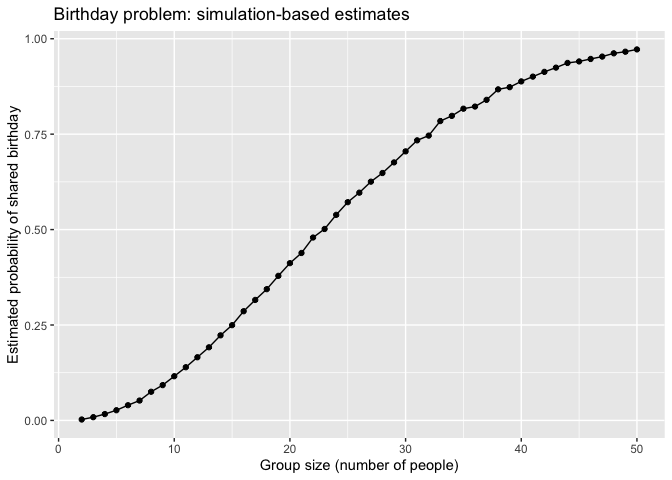
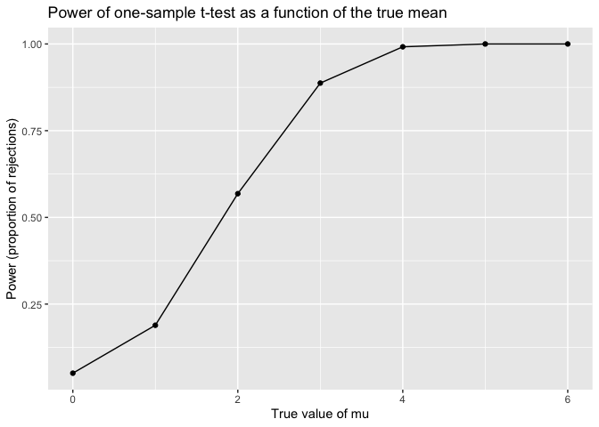
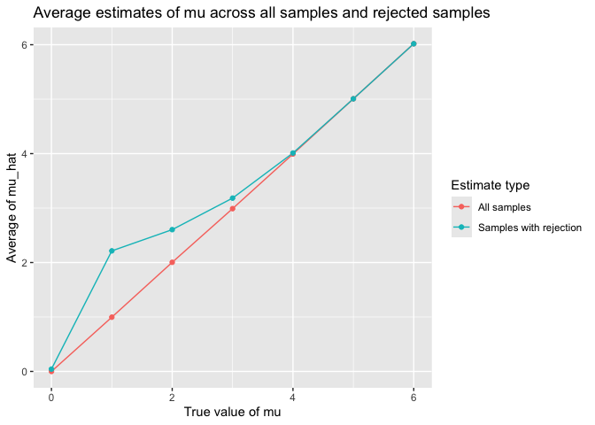

p8105_hw5_ym3139
================
Yutong Mao (UNI: ym3139)
2025-11-13

# Problem 0

For this assignment, I created a public GitHub repository named
`p8105_hw5_ym3139` along with an R project of the same name. All data
files required for the assignment are stored in the `data/` subdirectory
and accessed via relative paths. All code for Problems 1 through 3 is
contained within a single R Markdown file, `p8105_hw5_ym3139.Rmd`, which
is rendered in `github_document` format.

# Problem 1

In this study, I employed a simulation approach to investigate the
birthday paradox. For groups ranging from 2 to 50 individuals, I
estimated the probability that at least two members share the same
birthday through 10,000 simulation runs.

``` r
# Function to simulate birthdays for a group and check for duplicates
check_birthday_match <- function(n) {
  
  # Simulate n birthdays as integers from 1 to 365
  birthdays <- sample(1:365, size = n, replace = TRUE)
  
  # Check whether there is at least one duplicated birthday
  any_duplicated <- any(duplicated(birthdays))
  
  # Return TRUE if there is a shared birthday, FALSE otherwise
  any_duplicated
}
```

``` r
check_birthday_match(2)    # very small group, low chance of match
```

    ## [1] FALSE

``` r
check_birthday_match(50)   # larger group, higher chance of match
```

    ## [1] TRUE

``` r
set.seed(1)  # set seed for reproducibility

# Create a data frame of all simulation settings
bday_sim_results <- 
  expand_grid(
    group_size = 2:50,      # number of people in the room
    iter       = 1:10000    # simulation iteration index
  ) |>
  mutate(
    # For each row, run the birthday function once
    has_match = map_lgl(group_size, check_birthday_match)
  ) |>
  group_by(group_size) |>
  summarize(
    # Estimated probability of at least one shared birthday
    prob_match = mean(has_match)
  )

# Look at the first few rows of the results
bday_sim_results
```

    ## # A tibble: 49 × 2
    ##    group_size prob_match
    ##         <int>      <dbl>
    ##  1          2     0.0024
    ##  2          3     0.0085
    ##  3          4     0.0167
    ##  4          5     0.0267
    ##  5          6     0.0399
    ##  6          7     0.0521
    ##  7          8     0.0751
    ##  8          9     0.0925
    ##  9         10     0.116 
    ## 10         11     0.139 
    ## # ℹ 39 more rows

``` r
# Plot the estimated probability as a function of group size
bday_sim_results |>
  ggplot(aes(x = group_size, y = prob_match)) +
  geom_line() +
  geom_point() +
  labs(
    x = "Group size (number of people)",
    y = "Estimated probability of shared birthday",
    title = "Birthday problem: simulation-based estimates"
  )
```

<!-- -->

As shown in the chart, the probability of at least two people sharing a
birthday increases rapidly as the group size expands. When fewer than 10
people are in the room, this probability approaches 0; when the group
size reaches just over 20 people, the probability is approximately 0.5;
and when the number of people reaches around 50, the probability
approaches 1. This suggests that our intuition about the birthday
problem may underestimate how quickly the probability increases with
group size.

# Problem 2

In this study, I employed simulation methods to examine the test power
of the one-sample t-test under different conditions of true population
means. The sample size was fixed at $n = 30$, and the standard deviation
was fixed at $\sigma = 5$.

``` r
# Function to simulate one dataset and run a one-sample t-test
sim_one_ttest <- function(mu, n = 30, sigma = 5) {
  
  # Generate n observations from Normal(mu, sigma)
  x <- rnorm(n, mean = mu, sd = sigma)
  
  # Perform one-sample t-test for H0: mu = 0
  t_out <- t.test(x, mu = 0)
  
  # Use broom::tidy to extract estimate and p-value
  t_tidy <- broom::tidy(t_out)
  
  # Return a tibble with the sample mean and p-value
  tibble(
    mu_hat  = t_tidy$estimate,   # sample mean
    p_value = t_tidy$p.value     # p-value for H0: mu = 0
  )
}
```

``` r
sim_one_ttest(mu = 0)
```

    ## # A tibble: 1 × 2
    ##   mu_hat p_value
    ##    <dbl>   <dbl>
    ## 1  -1.62  0.0545

``` r
sim_one_ttest(mu = 3)
```

    ## # A tibble: 1 × 2
    ##   mu_hat p_value
    ##    <dbl>   <dbl>
    ## 1   2.46  0.0141

``` r
set.seed(1)  # set seed for reproducibility

# Run 5000 simulations for each true value of mu
ttest_results <- 
  expand_grid(
    true_mu = 0:6,          # true mean values
    iter    = 1:5000        # simulation iteration index
  ) |>
  mutate(
    # For each row, simulate one dataset and run the t-test
    sim_df = map(true_mu, sim_one_ttest)
  ) |>
  unnest(sim_df) |>
  mutate(
    # Indicator for rejecting the null at alpha = 0.05
    reject_null = p_value < 0.05
  )

# Take a quick look at the simulated results
ttest_results |> head()
```

    ## # A tibble: 6 × 5
    ##   true_mu  iter mu_hat p_value reject_null
    ##     <int> <int>  <dbl>   <dbl> <lgl>      
    ## 1       0     1  0.412  0.629  FALSE      
    ## 2       0     2  0.664  0.368  FALSE      
    ## 3       0     3  0.551  0.534  FALSE      
    ## 4       0     4  0.567  0.487  FALSE      
    ## 5       0     5 -1.65   0.0599 FALSE      
    ## 6       0     6  1.19   0.229  FALSE

``` r
# Compute the power (proportion of rejections) for each true mu
power_results <- 
  ttest_results |>
  group_by(true_mu) |>
  summarize(
    power = mean(reject_null)   # proportion of times H0 is rejected
  )

power_results
```

    ## # A tibble: 7 × 2
    ##   true_mu  power
    ##     <int>  <dbl>
    ## 1       0 0.0508
    ## 2       1 0.189 
    ## 3       2 0.568 
    ## 4       3 0.887 
    ## 5       4 0.992 
    ## 6       5 1     
    ## 7       6 1

``` r
# Plot power (proportion of rejections) vs true mu
power_results |>
  ggplot(aes(x = true_mu, y = power)) +
  geom_line() +
  geom_point() +
  labs(
    x = "True value of mu",
    y = "Power (proportion of rejections)",
    title = "Power of one-sample t-test as a function of the true mean"
  )
```

<!-- -->

The figure shows that the power of the one-sample t-test gradually
increases as the true mean moves away from zero. When the true mean is
zero, the rejection probability approaches the nominal Type I error rate
of 0.05. As the true mean increases from 1 to 6, the test power steadily
rises and approaches 1. This indicates a positive correlation between
effect size and test power: the larger the effect, the easier it is to
detect.

As the true mean moves farther from 0 (i.e., the effect size increases),
the test’s power rises; when μ=0, the rejection rate approaches 0.05,
but as μ increases, power rapidly approaches 1.

``` r
# Compute average estimates of mu_hat
mu_estimates <- 
  ttest_results |>
  group_by(true_mu) |>
  summarize(
    avg_mu_hat_all    = mean(mu_hat),                # mean over all samples
    avg_mu_hat_reject = mean(mu_hat[reject_null])    # mean only when H0 is rejected
  )

mu_estimates
```

    ## # A tibble: 7 × 3
    ##   true_mu avg_mu_hat_all avg_mu_hat_reject
    ##     <int>          <dbl>             <dbl>
    ## 1       0      -0.000262            0.0426
    ## 2       1       0.996               2.21  
    ## 3       2       2.00                2.60  
    ## 4       3       2.99                3.18  
    ## 5       4       3.99                4.01  
    ## 6       5       5.01                5.01  
    ## 7       6       6.02                6.02

``` r
# Reshape to long format for plotting
mu_estimates_long <- 
  mu_estimates |>
  pivot_longer(
    avg_mu_hat_all:avg_mu_hat_reject,
    names_to  = "estimate_type",
    values_to = "avg_estimate"
  ) |>
  mutate(
    # Give more descriptive labels for plotting
    estimate_type = recode(
      estimate_type,
      avg_mu_hat_all    = "All samples",
      avg_mu_hat_reject = "Samples with rejection"
    )
  )

mu_estimates_long
```

    ## # A tibble: 14 × 3
    ##    true_mu estimate_type          avg_estimate
    ##      <int> <chr>                         <dbl>
    ##  1       0 All samples               -0.000262
    ##  2       0 Samples with rejection     0.0426  
    ##  3       1 All samples                0.996   
    ##  4       1 Samples with rejection     2.21    
    ##  5       2 All samples                2.00    
    ##  6       2 Samples with rejection     2.60    
    ##  7       3 All samples                2.99    
    ##  8       3 Samples with rejection     3.18    
    ##  9       4 All samples                3.99    
    ## 10       4 Samples with rejection     4.01    
    ## 11       5 All samples                5.01    
    ## 12       5 Samples with rejection     5.01    
    ## 13       6 All samples                6.02    
    ## 14       6 Samples with rejection     6.02

``` r
# Plot average mu_hat vs true mu for all samples and rejected samples
mu_estimates_long |>
  ggplot(aes(x = true_mu, y = avg_estimate, color = estimate_type)) +
  geom_line() +
  geom_point() +
  labs(
    x = "True value of mu",
    y = "Average of mu_hat",
    color = "Estimate type",
    title = "Average estimates of mu across all samples and rejected samples"
  )
```

<!-- -->

Across all samples, the average of μ̂ approximates the true value $\mu$
under each setting, consistent with the property of sample means as
unbiased estimators.

However, when averaging μ̂ only from samples that reject the null
hypothesis, the resulting mean exceeds the true value $\mu$. This
indicates selection bias: we condition only on events where the observed
mean is far from zero and yields a small p-value. Therefore, in
hypothesis rejection tests, the sample mean of μ̂ does not approximate
the true value $\mu$.

# Problem 3
